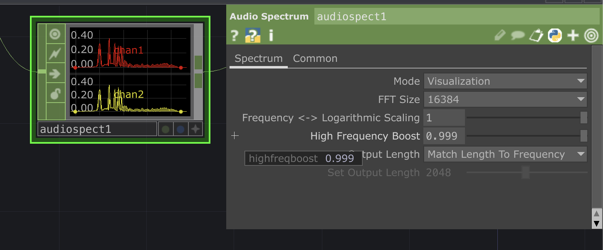
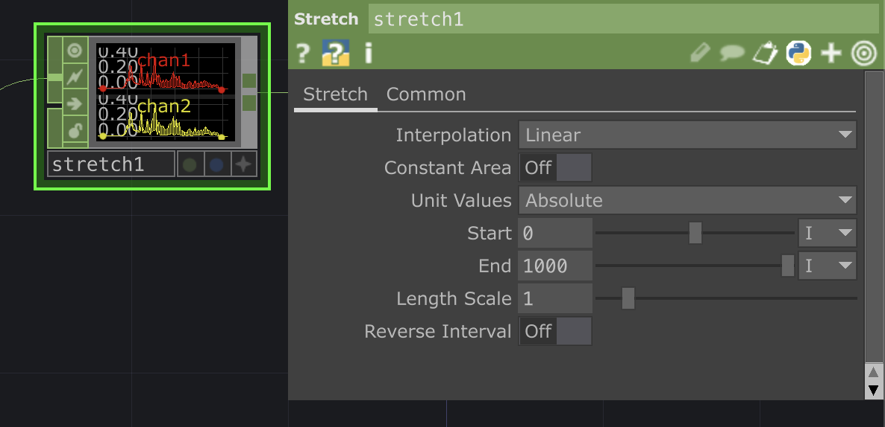

# Resonant Flow

실시간으로 흐르는 소리를 계속 변화하는 지형으로 번역하는 제너레이티브 오디오-비주얼 작업입니다. 음의 높낮이와 볼륨, 음색이 형태의 굴곡과 색으로 옮겨지며, 청각적 흐름을 시각적 언어로 재구성합니다.


<br>


<br>

## Overview

소리는 눈에 보이지 않지만 끊임없이 흐르고 변화합니다. Resonant Flow는 실시간 오디오 입력을 분석해, 그 흐름을 3D 지형(terrain) 형태의 시각적 구조로 옮기는 작업입니다. 진폭과 주파수의 변화가 곧 형태의 높낮이와 색으로 번역되며, 소리가 멈추지 않는 한 지형도 고정되지 않고 계속 흐르며 변화합니다. 색상은 별도의 셰이더 없이 Ramp와 Constant MAT의 조합만으로 구성해, 오디오 진폭에 따라 자연스러운 컬러 하모니가 실시간으로 이어지도록 했습니다.

## Concept

청각적 경험은 본래 형태가 없지만, 우리는 늘 그것을 몸으로 느끼고 기억합니다. Resonant Flow는 그 감각의 번역 — 들리는 것을 보이는 것으로, 순간을 지속되는 형태로 바꾸는 실험입니다. 지형이 매 순간 다시 그려지듯, 이 작업은 고정된 결과물이 아니라 소리와 함께 계속 생성되는 하나의 흐름으로 존재합니다.

## Tech Stack

| 영역 | 사용 기술 |
|---|---|
| 오디오 분석 | Audio Device In CHOP, Audio Spectrum CHOP (소리를 주파수별로 분석), Stretch CHOP (데이터 개수 맞추기) |
| 지오메트리 생성 | CHOP to SOP (오디오 값을 지형의 높이로 변환) |
| 지오메트리 | Geometry COMP (Merge SOP, Transform SOP, Point SOP) |
| 재질/컬러 | Ramp TOP + Constant MAT 조합으로만 컬러 구성 |

## Pipeline

```
Audio Device In CHOP
    ↓
Audio Spectrum CHOP (소리를 주파수별로 분석)
    ↓
Stretch CHOP (데이터 개수를 지형의 점 개수에 맞게 조정)
    ↓
CHOP to SOP (오디오 값 → 지형의 높이로 변환)
    ↓
Merge SOP → Transform SOP
    ↓
Point SOP (높이 값을 색상 좌표로도 재사용)
    ↓
Geometry COMP (geo1)
    ↓
Constant MAT — Color Map → Ramp TOP (컬러 그라디언트)
    ↓
Render TOP
    ↓
Out TOP (최종 출력)
```

### Audio Spectrum CHOP



| 파라미터 | 값 | 의미 |
|---|---|---|
| Mode | Visualization | 정밀한 분석용이 아니라, 화면에 보여주기 좋게 계산하는 방식 |
| FFT Size | 16384 | 소리를 얼마나 세밀하게 쪼개서 분석할지 정하는 값 (숫자가 클수록 더 세밀함) |
| Frequency ↔ Logarithmic Scaling | 1 | 사람이 실제로 듣는 방식과 비슷하게, 낮은 음보다 높은 음의 차이를 더 잘 구분되게 만드는 설정 |
| High Frequency Boost | 0.999 | 원래 잘 안 들리는 높은 음 소리를 화면에서 잘 보이도록 키워주는 설정 |
| Output Length | Match Length To Frequency | 위 설정에 따라 결과 데이터 개수가 자동으로 정해짐 (여기서는 2048개) |

### Stretch CHOP



Audio Spectrum CHOP에서 나온 데이터 개수(2048개)를, 지형을 이루는 점의 개수에 맞게 다시 조정해주는 노드입니다.

| 파라미터 | 값 | 의미 |
|---|---|---|
| Interpolation | Linear | 데이터 사이사이를 부드럽게 이어주는 방식 |
| Unit Values | Absolute | 아래 Start/End 값을 비율이 아니라 실제 개수로 지정 |
| Start / End | 0 / 1000 | 결과 데이터 개수를 1000개로 고정 |

원본 데이터 개수(2048개)와 지형의 점 개수(1000개)가 서로 달라서, 소리 값 하나하나가 지형의 한 지점씩과 정확히 짝지어지도록 여기서 개수를 맞춰줍니다.

## Key Techniques

- 사람 귀가 소리를 듣는 방식에 가깝게, 낮은 음보다 높은 음의 차이를 더 잘 보이도록 스펙트럼 분석 설정
- 오디오 데이터의 개수와 지형을 이루는 점의 개수를 서로 맞춰서, 소리 하나하나가 지형의 한 지점씩과 정확히 연결되도록 처리
- 실시간 오디오 값으로 지형의 높낮이와 색을 함께 만들어냄
- 별도의 셰이더 코드 없이, Ramp(그라디언트)와 Constant MAT(단색 재질)의 조합만으로 오디오 크기에 따라 색이 자연스럽게 변하도록 구현
- 지형의 높이 값을 색상 텍스처 좌표로도 재사용해서, 추가 장치 없이 높이와 색이 함께 반응하게 연결
- Geometry COMP를 이용한 실시간 지형(terrain) 형태 생성

## How to Run

1. TouchDesigner 2025.x 이상 설치
2. `project.toe` 파일 열기
3. Audio Device In CHOP에서 오디오 인풋 디바이스 선택
4. 상단 Realtime 토글 On
5. 오디오를 재생하면 실시간으로 반응하는 비주얼 확인 가능

## Screenshots

<table>
  <tr>
    <td></td>
    <td></td>
  </tr>
</table>
